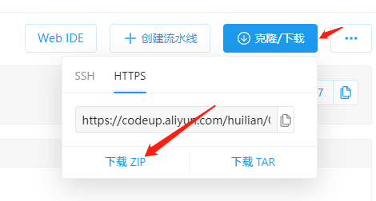
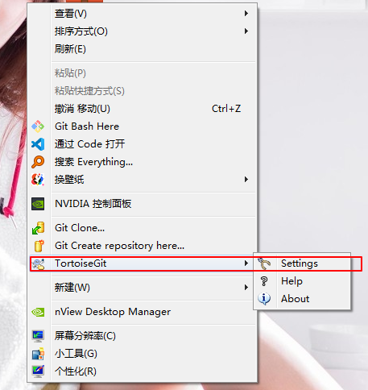
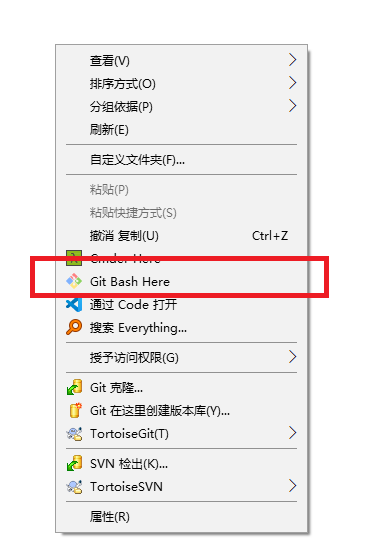
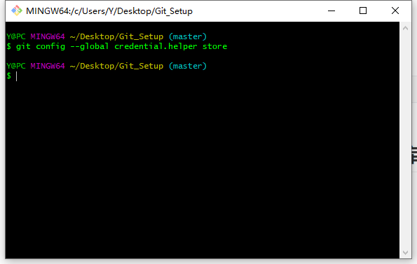
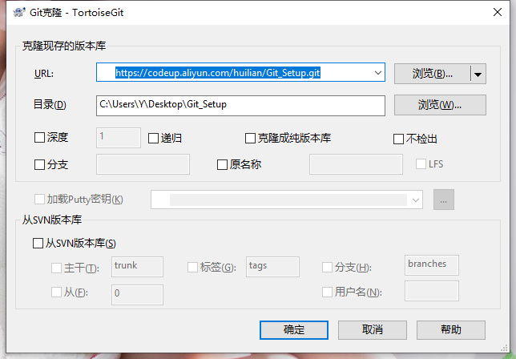
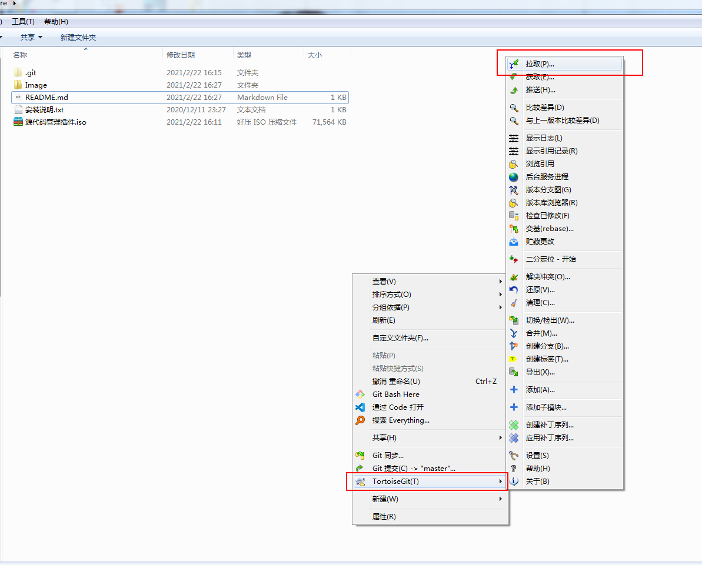
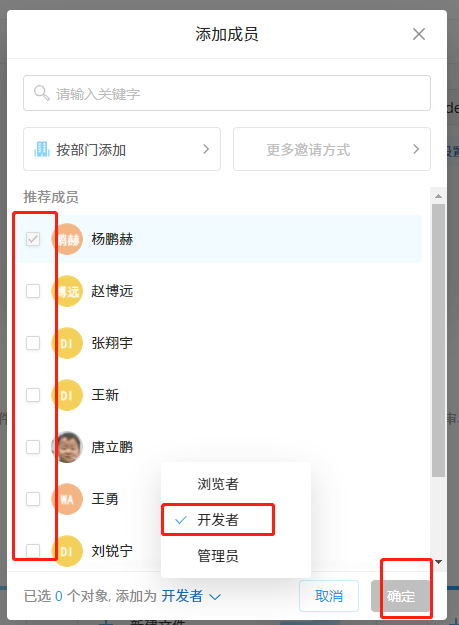
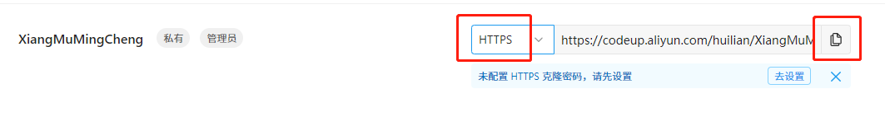
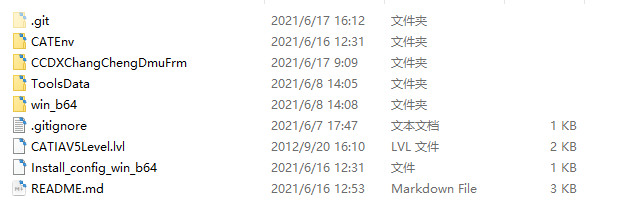

# Git环境搭建

## 文件下载

[.gitignore ](./.gitignore )

[01-Git-2.32.0-64-bit.exe](./01-Git-2.32.0-64-bit.exe) </br>
[02-TortoiseGit-2.12.0.0-64bit.msi](./02-TortoiseGit-2.12.0.0-64bit.msi)</br>
[03-TortoiseGit-LanguagePack-2.12.0.0-64bit-zh_CN.msi](./03-TortoiseGit-LanguagePack-2.12.0.0-64bit-zh_CN.msi) 


## 设置邮箱 克隆帐号&密码


## 下载本仓库



---

## 安装软件

挂载(或解压)源码版本控制环境包.iso文件 按照01-02-03顺序安装


## 设置中文




## 填写用户信息 邮箱一定要与平台绑定邮箱一致!


## 设置记住密码

打开 Git Bash



``` Shell
git config --global credential.helper store
```



## 克隆仓库


https://codeup.aliyun.com/huilian/Git_Setup.git




## 拉取




## 提交&推送


# 创建云端仓库

 

  

## 添加成员


## 勾选要添加的人设置权限

 



 

克隆之后将要添加的项目文件 和 本项目的 .gitignore 文件 放入克隆文件夹内

 

之后右键提交推送

 