#  Git环境安装

## 按照01 02 03 顺序安装下列应用程序

[01-Git-2.32.0-64-bit.exe](./01-Git-2.32.0-64-bit.exe) </br>
[02-TortoiseGit-2.12.0.0-64bit.msi](./02-TortoiseGit-2.12.0.0-64bit.msi)</br>
[03-TortoiseGit-LanguagePack-2.12.0.0-64bit-zh_CN.msi](./03-TortoiseGit-LanguagePack-2.12.0.0-64bit-zh_CN.msi) 


## 配置

### Git信息

 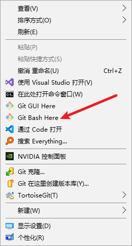

``` shell
git config --global user.name "Your Name"      # 请替换你的用户名
git config --global user.email your@email      # 请替换你自己的公司邮箱
```

### 云效信息

登陆云效https://codeup.aliyun.com/

 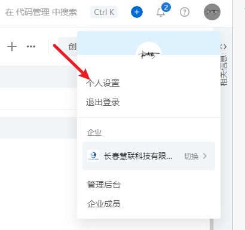

绑定邮箱

 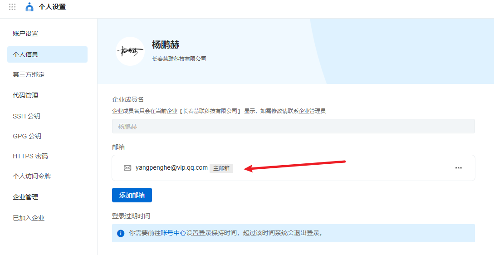

设置克隆账号密码

 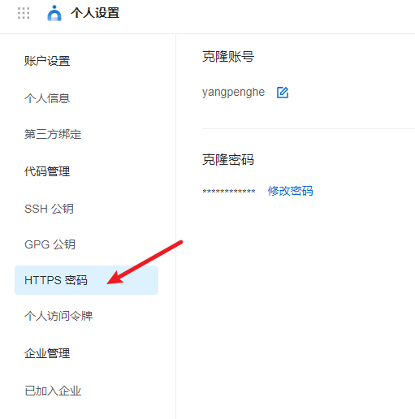

## 克隆教程

 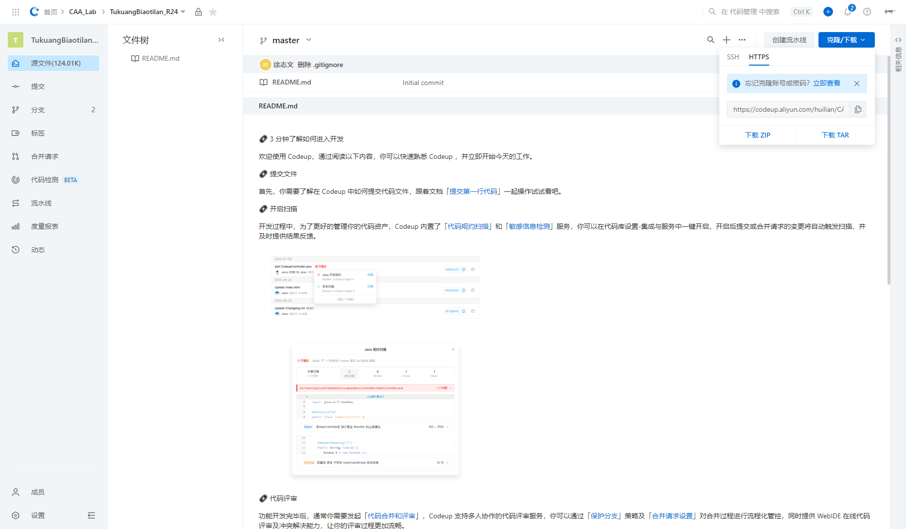

 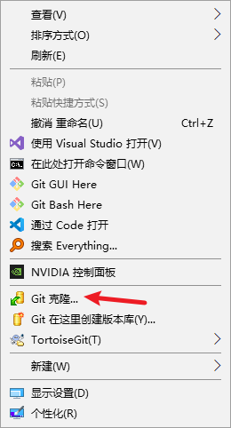

输入刚才设置的账号密码

 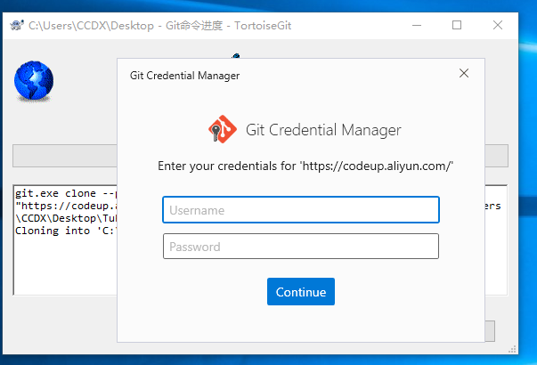

克隆成功

 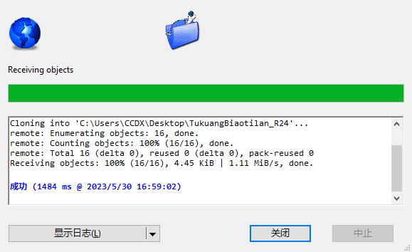

## 提交

 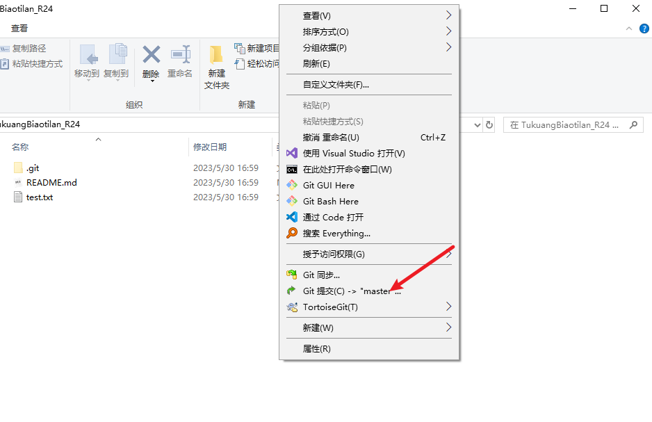

填写日志信息 提交并推送

 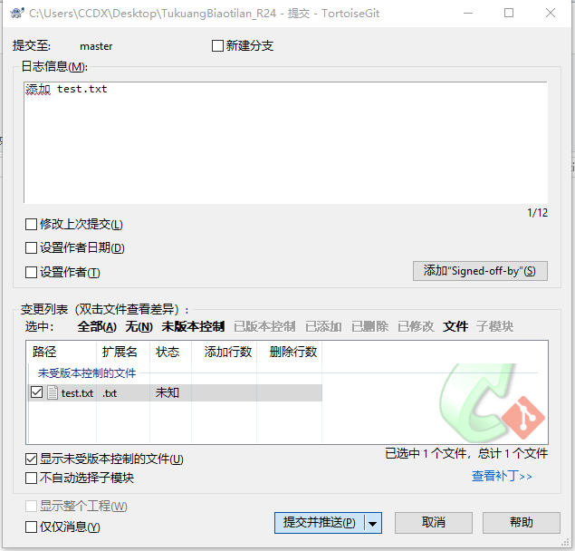

推送成功

 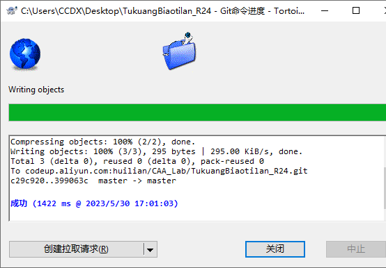

## 拉取

 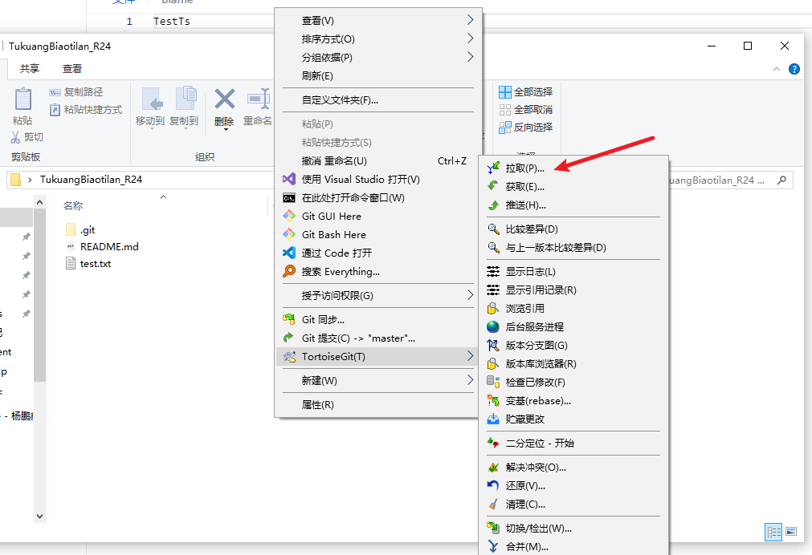

 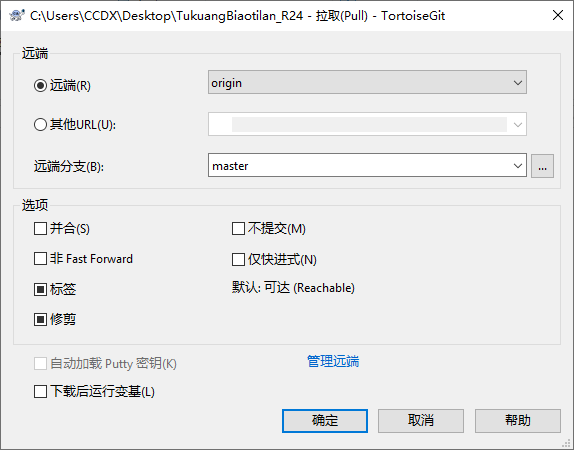

 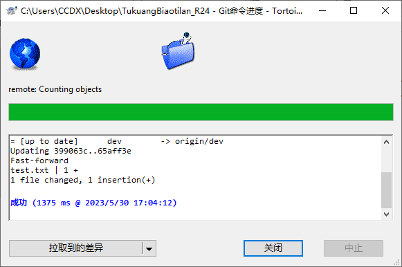

